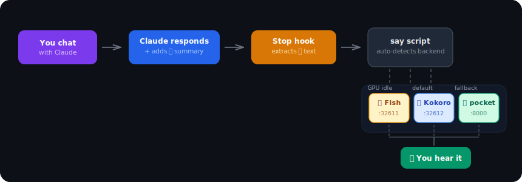
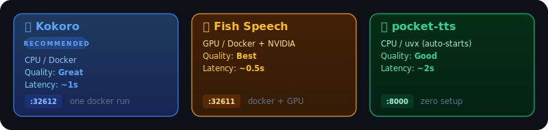
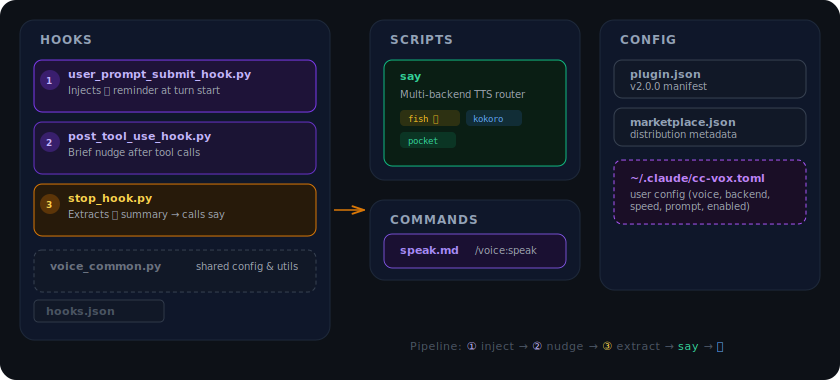
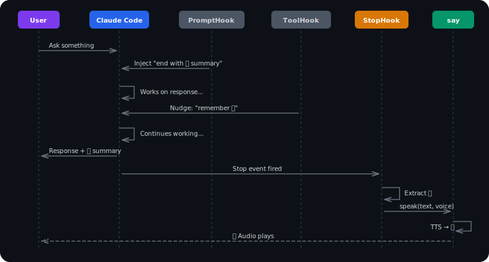

<p align="center">
  
  
</p>

<p align="center">
  <a href="#-quick-start"></a>
  <a href="LICENSE"></a>
  
  
  
</p>

<p align="center">
  Give Claude Code a voice.<br>
  Hear spoken summaries after every response — zero friction, multiple TTS backends.
</p>

<br>

<details>
<summary><b>📖 Table of Contents</b></summary>

- [✨ Features](#-features)
- [🔁 How It Works](#-how-it-works)
- [� Demo](#-demo)
- [�🎙️ Backends](#️-backends)
- [🚀 Quick Start](#-quick-start)
  - [1. Install the plugin](#1-install-the-plugin)
  - [2. Pick a backend](#2-pick-a-backend)
  - [3. Start using Claude](#3-start-using-claude)
- [💬 Usage](#-usage)
  - [Slash Commands](#slash-commands)
  - [Voices](#voices)
- [⚙️ Configuration](#️-configuration)
  - [Environment Variables](#environment-variables)
- [🏗️ Architecture](#️-architecture)
- [🔀 Sequence Diagram](#-sequence-diagram)
- [📁 Project Structure](#-project-structure)
- [🤔 Why cc-vox?](#-why-cc-vox)
- [🔧 Troubleshooting](#-troubleshooting)
- [❓ FAQ](#-faq)
- [🛠️ Development](#️-development)
- [🤝 Contributing](#-contributing)
- [🙏 Credits](#-credits)

</details>

<br>

---

## ✨ Features

- 🔊 **Automatic voice feedback** — Claude speaks a summary after every response
- 🎯 **Multi-backend TTS** — Qwen3-TTS, Fish Speech, Chatterbox (GPU), Kokoro (CPU), pocket-tts (zero setup)
- 🔄 **Auto-detection** — Picks the best available backend automatically
- 🎛️ **Slash commands** — Control voice, backend, personality on the fly
- 🗣️ **9 voices** — Cross-backend voice mapping between Kokoro and pocket-tts
- ⚡ **Zero config fallback** — pocket-tts auto-starts via `uvx`, nothing to install
- 🧠 **Smart GPU awareness** — Skips GPU backends when your GPU is busy
- 🎭 **Voice personality** — Set prompts like "be chill" or "be upbeat"

---

## 🔁 How It Works

<p align="center">
  
</p>

> [!NOTE]
> The entire pipeline is hands-free. Once installed, Claude automatically includes voice summaries — no prompting required.

---

## � Demo

```
┌─────────────────────────────────────────────────────────────────┐
│ $ claude                                                        │
│                                                                 │
│ You: refactor the auth module to use JWT tokens                 │
│                                                                 │
│ Claude: I've refactored the authentication module...            │
│ [... full response ...]                                         │
│                                                                 │
│ 📢 Done! I refactored auth to use JWT. Changed 3 files:        │
│    auth.py, middleware.py, and config.py. All tests pass.       │
│                                                                 │
│ 🔊 ████████████████████░░░░ Speaking...                        │
└─────────────────────────────────────────────────────────────────┘
```

> The `📢` summary is extracted by the stop hook and spoken aloud through your chosen TTS backend.

---

## 🎙️ Backends

<p align="center">
  
</p>

In **auto** mode (default), cc-vox tries Qwen3-TTS → Fish Speech → Chatterbox → Kokoro → pocket-tts and uses the first available.
GPU backends are skipped when GPU utilization exceeds the threshold (default 80%).

---

## 🚀 Quick Start

### 1. Install the plugin

```bash
claude plugin marketplace add BestSithInEU/cc-vox
claude plugin install voice
```

### 2. Pick a backend

<details>
<summary><b>Option A: Zero setup</b> — pocket-tts auto-starts via uvx, nothing to install</summary>

<br>

> [!TIP]
> Just use Claude Code — [pocket-tts](https://huggingface.co/kyutai/pocket-tts) will auto-download and start on first speech. No Docker, no GPU needed.

Optionally pre-download the model:

```bash
hf download kyutai/pocket-tts
```

</details>

<details>
<summary><b>Option B: Kokoro</b> ⭐ recommended — great quality, CPU-only Docker</summary>

<br>

```bash
docker run -d --name kokoro \
  -p 32612:8880 \
  ghcr.io/remsky/kokoro-fastapi-cpu:latest
```

> [!TIP]
> Kokoro offers the best balance of quality and simplicity. One command, CPU-only, great results.

</details>

<details>
<summary><b>Option C: Qwen3-TTS</b> ⭐ — best quality, voice cloning, requires NVIDIA GPU</summary>

<br>

```bash
# Clone the server and start via Docker Compose
cd tools/tts && git clone https://github.com/ValyrianTech/Qwen3-TTS_server qwen3-tts
docker compose -f tts/docker-compose.yml --profile gpu up -d qwen3-tts
```

Supports voice cloning — upload a reference audio clip to create custom voices:

```bash
curl -X POST http://localhost:32614/upload_audio/ \
  -F "audio_file_label=my_voice" \
  -F "file=@reference.wav"
```

> [!IMPORTANT]
> Requires an NVIDIA GPU with 8GB+ VRAM. Supports 10 languages.

</details>

<details>
<summary><b>Option D: Fish Speech</b> — high quality, requires NVIDIA GPU</summary>

<br>

```bash
# Download the model (0.5B params, 13 languages)
hf download fishaudio/openaudio-s1-mini --local-dir checkpoints/openaudio-s1-mini

# Start the container
docker run -d --name fish-speech \
  --gpus all \
  -p 32611:7860 \
  -v ./checkpoints:/app/checkpoints \
  fishaudio/fish-speech:latest
```

> [!IMPORTANT]
> Requires an NVIDIA GPU with Docker GPU support configured. The [openaudio-s1-mini](https://huggingface.co/fishaudio/openaudio-s1-mini) model is licensed CC-BY-NC-SA-4.0.

</details>

<details>
<summary><b>Option E: Chatterbox</b> — voice cloning, requires NVIDIA GPU</summary>

<br>

```bash
docker run -d --name chatterbox \
  --gpus all \
  -p 32613:4123 \
  travisvn/chatterbox-tts-api:latest
```

> [!IMPORTANT]
> Requires an NVIDIA GPU with 4-8GB VRAM. OpenAI-compatible API.

</details>

### 3. Start using Claude

```bash
claude  # Voice feedback is automatic!
```

---

## 💬 Usage

Voice feedback is automatic. Claude speaks a summary after each response.

### Slash Commands

```
/voice:speak                  Enable voice
/voice:speak stop             Disable voice
/voice:speak af_bella         Change voice
/voice:speak prompt be chill  Set voice personality
/voice:speak prompt           Clear personality
/voice:speak backend kokoro   Force backend
/voice:speak backend auto     Auto-detect (default)
/voice:speak speed 1.3        Adjust speech speed (kokoro)
/voice:speak max_sentences 4  Longer summaries
/voice:speak fallback on      Try other backends if forced one is down
```

### Voices

> Voice names work across all backends — cc-vox auto-maps between Kokoro and pocket-tts names.

| Kokoro name | pocket-tts alias | Gender | Accent |
|:-----------:|:----------------:|:------:|:------:|
| `af_heart` ★ | `alba` | F | American |
| `af_bella` | `azure` | F | American |
| `af_nicole` | `fantine` | F | American |
| `af_sarah` | `cosette` | F | American |
| `af_sky` | `eponine` | F | American |
| `am_adam` | `marius` | M | American |
| `am_michael` | `jean` | M | American |
| `bf_emma` | `azelma` | F | British |
| `bm_george` | — | M | British |

<sub>★ default voice</sub>

---

## ⚙️ Configuration

`~/.claude/cc-vox.toml`

```toml
[core]
enabled = true
voice = "af_heart"       # see voices below
backend = "auto"         # auto | kokoro | fish-speech | pocket-tts | chatterbox | qwen3-tts

[tuning]
speed = 1.0              # 0.5-2.0 (kokoro only)
max_sentences = 2        # max sentences in spoken summary (1-10)
fallback = true          # try other backends when forced one is down

[style]
prompt = "be upbeat and encouraging"
```

### Settings

| Setting | Default | Description |
|:--------|:-------:|:------------|
| `tuning.speed` | `1.0` | Speech speed 0.5–2.0 (kokoro only) |
| `tuning.max_sentences` | `2` | Max sentences in spoken summary (1–10) |
| `tuning.fallback` | `true` | Try other backends when forced one is down |

### Environment Variables

| Variable | Default | Description |
|:---------|:-------:|:------------|
| `TTS_BACKEND` | `auto` | Override backend: `auto` `qwen3-tts` `fish-speech` `chatterbox` `kokoro` `pocket-tts` |
| `KOKORO_PORT` | `32612` | Kokoro Docker port |
| `FISH_SPEECH_PORT` | `32611` | Fish Speech Docker port |
| `CHATTERBOX_PORT` | `32613` | Chatterbox Docker port |
| `QWEN3_TTS_PORT` | `32614` | Qwen3-TTS Docker port |
| `TTS_PORT` | `8000` | pocket-tts port |
| `GPU_THRESHOLD` | `80` | GPU % above which Fish Speech is skipped |

---

## 🏗️ Architecture

<p align="center">
  
</p>

---

## 🔀 Sequence Diagram

<p align="center">
  
</p>

---

## 📁 Project Structure

```
cc-vox/
├── hooks/                              # Claude Code hook scripts
│   ├── hooks.json                      # Hook registration manifest
│   ├── user_prompt_submit_hook.py      # ① Injects 📢 reminder at turn start
│   ├── post_tool_use_hook.py           # ② Brief nudge after tool calls
│   ├── stop_hook.py                    # ③ Extracts summary → calls say
│   ├── voice_common.py                 # Config parsing (TOML) & reminders
│   ├── session.py                      # Session JSONL file I/O
│   ├── summarize.py                    # Headless Claude fallback
│   └── tts/                            # TTS backend package
│       ├── __init__.py                 # Registry + select_backend()
│       ├── _protocol.py                # TTSBackend Protocol
│       ├── voices.py                   # Voice catalog (single source of truth)
│       ├── kokoro.py                   # Kokoro backend
│       ├── fish_speech.py              # Fish Speech backend
│       ├── chatterbox.py              # Chatterbox backend
│       ├── qwen3_tts.py              # Qwen3-TTS backend
│       ├── pocket_tts.py              # pocket-tts backend
│       ├── _playback.py                # Audio playback + locking
│       └── _session_state.py           # Session sentinel files
├── commands/
│   └── speak.md                        # /voice:speak slash command definition
├── scripts/
│   └── say                             # Thin TTS CLI (uses tts package)
├── docs/                               # Zensical documentation
├── assets/                             # SVG diagrams & logos
│   ├── logo-dark.svg                   # Animated logo (dark mode)
│   ├── logo-light.svg                  # Animated logo (light mode)
│   ├── flow.svg                        # Pipeline flow diagram
│   ├── architecture.svg                # Component architecture diagram
│   ├── backends.svg                    # Backend comparison cards
│   └── sequence.svg                    # Sequence diagram
├── .claude-plugin/
│   ├── plugin.json                     # v2.0.0 plugin manifest
│   └── marketplace.json                # Distribution metadata
├── zensical.toml                       # Documentation config
├── LICENSE                             # MIT
└── README.md
```

---

## 🤔 Why cc-vox?

| | **cc-vox** | **Manual TTS** | **No voice** |
|:--|:--:|:--:|:--:|
| Automatic speech after every response | ✅ | ❌ manual | ❌ |
| Multiple TTS backends | ✅ 5 backends | ⚠️ 1 at a time | — |
| Auto-detects best backend | ✅ | ❌ | — |
| Zero-setup option | ✅ pocket-tts | ❌ | — |
| GPU-aware routing | ✅ | ❌ | — |
| Voice personality prompts | ✅ | ❌ | — |
| Cross-backend voice mapping | ✅ | ❌ | — |
| Slash command control | ✅ | ❌ | — |
| Setup time | **~2 min** | 30+ min | 0 min |

---

## 🔧 Troubleshooting

<details>
<summary><b>No audio output</b></summary>

<br>

1. Check that voice is enabled: run `/voice:speak` in Claude Code
2. Verify your TTS backend is running:
   ```bash
   # Kokoro
   curl http://localhost:32612/v1/audio/speech -X POST -d '{}' 2>/dev/null && echo "OK" || echo "Not running"
   
   # Fish Speech
   curl http://localhost:32611 2>/dev/null && echo "OK" || echo "Not running"
   ```
3. Check system audio output device
4. Try forcing a backend: `/voice:speak backend pocket-tts`

</details>

<details>
<summary><b>Docker container won't start</b></summary>

<br>

```bash
# Check if port is already in use
lsof -i :32612  # Kokoro
lsof -i :32611  # Fish Speech

# Check Docker logs
docker logs kokoro
docker logs fish-speech
```

</details>

<details>
<summary><b>Fish Speech skipped (GPU threshold)</b></summary>

<br>

cc-vox checks GPU utilization before using Fish Speech. If your GPU is busy (default >80%), it falls back to Kokoro or pocket-tts.

```bash
# Check current GPU usage
nvidia-smi

# Raise the threshold
export GPU_THRESHOLD=95
```

</details>

<details>
<summary><b>Voice sounds wrong or uses wrong backend</b></summary>

<br>

```bash
# Force a specific backend
/voice:speak backend kokoro

# Check which backend is being used (verbose mode)
TTS_BACKEND=kokoro ./scripts/say "Testing Kokoro directly"
```

</details>

---

## ❓ FAQ

<details>
<summary><b>Does it work offline?</b></summary>

<br>

Yes — if you run Kokoro or Fish Speech locally via Docker, everything stays on your machine. pocket-tts also runs locally via `uvx`.

</details>

<details>
<summary><b>Can I add custom voices?</b></summary>

<br>

The voice list is currently fixed to the 9 voices that map cleanly across backends. Custom voice support depends on the backend you're using — Fish Speech supports voice cloning natively.

</details>

<details>
<summary><b>Does it slow down Claude?</b></summary>

<br>

No. TTS runs asynchronously after Claude finishes responding. The only overhead is a small system prompt injection (~50 tokens) to remind Claude to include a voice summary. With `fallback = true` (default), if your forced backend goes down, cc-vox transparently tries the next available backend.

</details>

<details>
<summary><b>Can I use it with other AI coding tools?</b></summary>

<br>

cc-vox is built specifically for Claude Code's hook system. The `say` script can be used standalone, but the automatic hook integration is Claude Code-specific.

</details>

<details>
<summary><b>How do I uninstall?</b></summary>

<br>

```bash
claude plugin uninstall voice
# Optionally remove Docker containers
docker rm -f kokoro fish-speech
```

</details>

---

## 🛠️ Development

```bash
# Run with local plugin directory
claude --plugin-dir ~/Documents/Projects/cc-vox

# Test say script directly
./scripts/say --voice af_heart "Hello, testing voice output"

# Force a specific backend
TTS_BACKEND=kokoro ./scripts/say "Testing Kokoro"

# Test with custom speed
./scripts/say --voice af_heart --speed 1.3 "Testing faster speech"
```

---

## 🤝 Contributing

Contributions are welcome! Here's how to get started:

1. **Fork** the repository
2. **Clone** your fork and set up the development environment:
   ```bash
   git clone https://github.com/<your-username>/cc-vox.git
   cd cc-vox
   claude --plugin-dir .
   ```
3. **Make your changes** — follow the existing code style
4. **Test** with at least one TTS backend running
5. **Submit a PR** with a clear description of your changes

> [!NOTE]
> Adding a new backend = create one file in `hooks/tts/` + one registry line in `__init__.py`. See the [Adding a Backend](https://BestSithInEU.github.io/cc-vox/development/adding-backends/) guide.

---

## 🙏 Credits

Based on the original [voice plugin](https://github.com/pchalasani/claude-code-tools/tree/main/plugins/voice) by [pchalasani](https://github.com/pchalasani), which pioneered the hook-based voice feedback architecture for Claude Code. cc-vox extends it with multi-backend TTS support and auto-detection.

---

<p align="center">
  <sub>MIT License · Made with 🔊 by <a href="https://github.com/BestSithInEU">BestSithInEU</a></sub>
</p>
