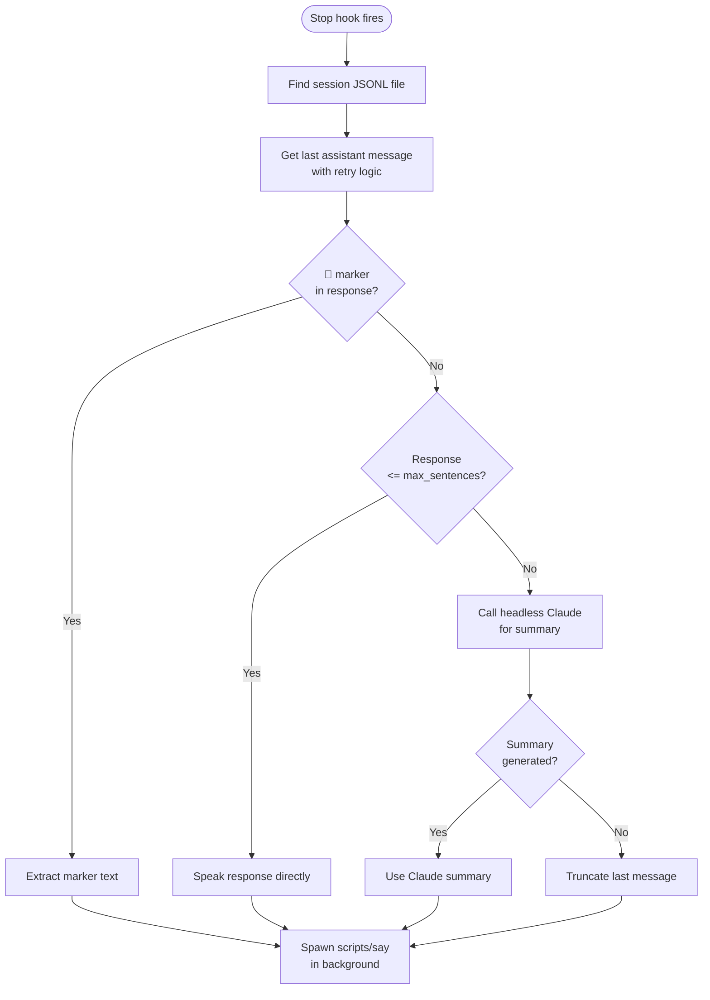

# Hook System

cc-vox uses three Claude Code hooks that form a pipeline: inject reminders, keep them fresh, then extract and speak the summary.

## Hook Registration

Hooks are declared in `hooks/hooks.json`:

```json
{
  "hooks": {
    "UserPromptSubmit": [{ "matcher": "*", "hooks": [{ "type": "command", "command": "python3 .../user_prompt_submit_hook.py", "timeout": 5 }] }],
    "PostToolUse":      [{ "matcher": "*", "hooks": [{ "type": "command", "command": "python3 .../post_tool_use_hook.py", "timeout": 5 }] }],
    "Stop":             [{ "matcher": "*", "hooks": [{ "type": "command", "command": "python3 .../stop_hook.py", "timeout": 60 }] }]
  }
}
```

All hooks match `*` (every event). The Stop hook has a 60-second timeout to allow for headless Claude summarization.

## Hook 1: UserPromptSubmit

**File:** `hooks/user_prompt_submit_hook.py`
**Trigger:** User sends a message
**Timeout:** 5 seconds

**Purpose:** Inject a system message reminding Claude to include a `📢` voice summary.

**Flow:**

1. Read voice config
2. If `enabled = false` and `just_disabled = true`, inject a one-time "voice disabled" message and clear the flag
3. If `enabled = true`, inject the full voice reminder with:
    - Max word limit
    - Summary style instructions
    - Custom personality prompt (if set)
4. Return `{"decision": "approve", "additionalContext": "..."}`

**Output example:**

```
Voice feedback is enabled. At the end of your response:
- If <=25 words of natural speakable text, no summary needed
- If <=25 words but contains code/paths/technical output, ADD a 📢 summary
- If longer, end with: 📢 [brief spoken summary]
```

## Hook 2: PostToolUse

**File:** `hooks/post_tool_use_hook.py`
**Trigger:** After each tool call
**Timeout:** 5 seconds

**Purpose:** Brief reminder to prevent context loss during long tool-heavy responses.

**Output example:**

```
[Voice feedback: when done, end with 📢 summary (max 25 words) if response is >25 words or contains code/paths]
```

## Hook 3: Stop

**File:** `hooks/stop_hook.py`
**Trigger:** Claude finishes responding
**Timeout:** 60 seconds

**Purpose:** Extract or generate a summary, then speak it.

**Summarization cascade:**



**Key detail:** The stop hook spawns `scripts/say` as a background subprocess (`Popen` with `/dev/null` stdout/stderr) so it doesn't block Claude Code.

## Hook Data Flow

All hooks communicate with Claude Code via JSON on stdin/stdout:

```python
# Input (from Claude Code on stdin)
{"session_id": "abc123", "tool_name": "Write", ...}

# Output (to Claude Code on stdout)
{"decision": "approve"}
# or
{"decision": "approve", "additionalContext": "...system message..."}
# or
{"decision": "approve", "systemMessage": "🔊 summary text"}
```
