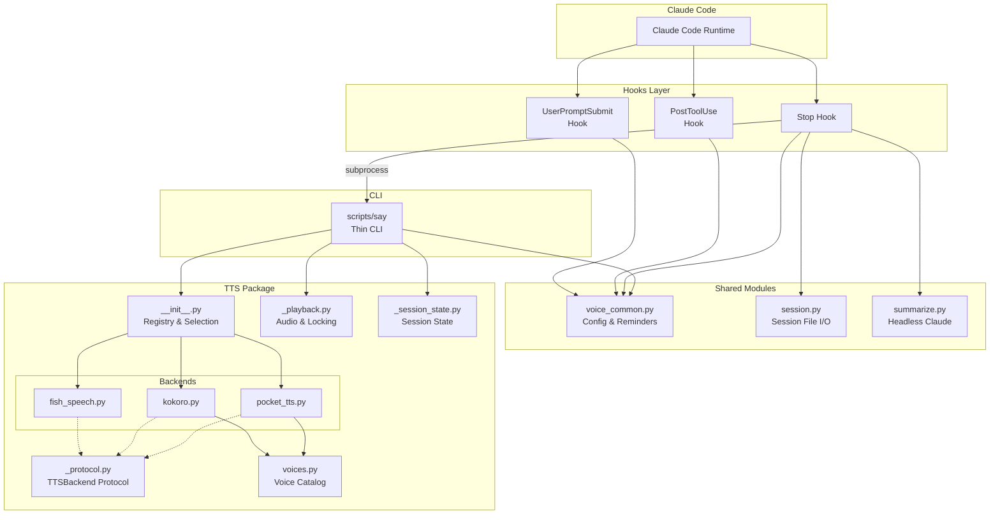

# Architecture Overview

cc-vox is structured as a modular Claude Code plugin with clear separation of concerns. Each component has a single responsibility, and backends are fully encapsulated — adding a new one requires creating one file and adding one registry line.

## Component Diagram

## Design Principles

### Single Responsibility

Each file owns exactly one concern:

| File | Responsibility |
|:-----|:---------------|
| `voice_common.py` | TOML config parsing and voice reminders |
| `session.py` | JSONL session file I/O |
| `summarize.py` | Headless Claude API call |
| `tts/voices.py` | Voice catalog and name resolution |
| `tts/_protocol.py` | Backend interface contract |
| `tts/_playback.py` | Audio playback and locking |
| `tts/_session_state.py` | TTS session sentinel files |
| Each `tts/*.py` backend | One backend's detection + generation |

### Open/Closed Principle

The TTS system is **open for extension, closed for modification**:

- Adding a new backend = create one file + one registry line
- No existing code needs to change
- The `TTSBackend` Protocol defines the contract

### Zero External Dependencies

cc-vox uses only the Python standard library at runtime:

- `urllib` for HTTP calls to TTS services
- `json` for API payloads and session parsing
- `subprocess` for audio playback and headless Claude
- `fcntl` for file-based playback locking
- `tomllib` for config parsing

The only external tool is `uv` (for the `scripts/say` shebang and pocket-tts auto-start).
