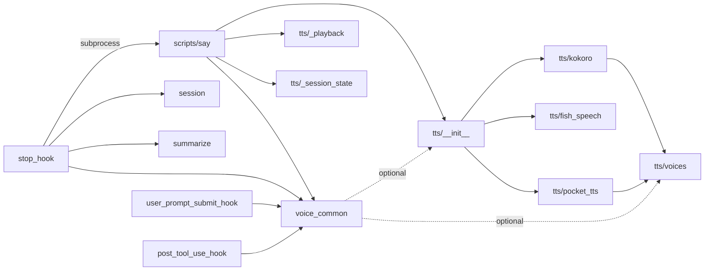

# Project Structure

## Directory Tree

```
cc-vox/
├── hooks/                              # Claude Code hook scripts
│   ├── hooks.json                      # Hook registration manifest
│   ├── user_prompt_submit_hook.py      # ① Injects 📢 reminder at turn start
│   ├── post_tool_use_hook.py           # ② Brief nudge after tool calls
│   ├── stop_hook.py                    # ③ Extracts summary → calls say
│   ├── voice_common.py                 # Config parsing (TOML) & reminders
│   ├── session.py                      # Session JSONL file I/O
│   ├── summarize.py                    # Headless Claude fallback
│   └── tts/                            # TTS backend package
│       ├── __init__.py                 # Registry + select_backend()
│       ├── _protocol.py                # TTSBackend Protocol
│       ├── voices.py                   # Voice catalog (single source of truth)
│       ├── kokoro.py                   # Kokoro backend
│       ├── fish_speech.py              # Fish Speech backend
│       ├── pocket_tts.py              # pocket-tts backend
│       ├── _playback.py                # Audio playback + locking
│       └── _session_state.py           # Session sentinel files
├── commands/
│   └── speak.md                        # /voice:speak slash command definition
├── scripts/
│   └── say                             # Multi-backend TTS router (uv script)
├── assets/                             # SVG diagrams & logos
│   ├── logo-dark.svg                   # Animated logo (dark mode)
│   ├── logo-light.svg                  # Animated logo (light mode)
│   ├── flow.svg                        # Pipeline flow diagram
│   ├── architecture.svg                # Component architecture
│   ├── backends.svg                    # Backend comparison cards
│   └── sequence.svg                    # Sequence diagram
├── .claude-plugin/
│   ├── plugin.json                     # v2.0.0 plugin manifest
│   └── marketplace.json                # Distribution metadata
├── docs/                               # Zensical documentation
├── zensical.toml                       # Zensical configuration
├── LICENSE                             # MIT
└── README.md
```

## Module Responsibilities

### Hook Layer

| Module | Lines | Responsibility |
|:-------|------:|:---------------|
| `user_prompt_submit_hook.py` | ~45 | Inject voice reminder into system prompt |
| `post_tool_use_hook.py` | ~30 | Brief reminder after tool calls |
| `stop_hook.py` | ~133 | 4-strategy summarization + spawn say |

### Shared Modules

| Module | Lines | Responsibility |
|:-------|------:|:---------------|
| `voice_common.py` | ~277 | TOML config, VoiceConfig dataclass, reminders |
| `session.py` | ~197 | Find/read session JSONL, extract messages |
| `summarize.py` | ~95 | Headless `claude -p` summarization fallback |

### TTS Package

| Module | Lines | Responsibility |
|:-------|------:|:---------------|
| `tts/__init__.py` | ~63 | Backend registry, `select_backend()` |
| `tts/_protocol.py` | ~30 | `TTSBackend` Protocol definition |
| `tts/voices.py` | ~55 | `VOICE_CATALOG`, `to_kokoro()`, `to_alias()` |
| `tts/kokoro.py` | ~49 | Kokoro backend implementation |
| `tts/fish_speech.py` | ~78 | Fish Speech backend implementation |
| `tts/pocket_tts.py` | ~86 | pocket-tts backend implementation |
| `tts/_playback.py` | ~91 | `play_audio()`, `PlaybackLock` |
| `tts/_session_state.py` | ~33 | `SessionState` sentinel files |

### CLI

| Module | Lines | Responsibility |
|:-------|------:|:---------------|
| `scripts/say` | ~106 | Arg parsing, backend selection, playback orchestration |

## Import Graph


