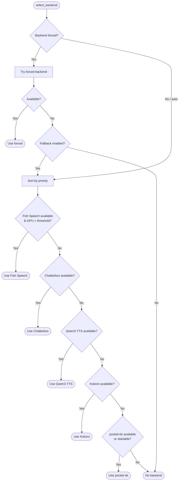

# TTS Backends

cc-vox supports five TTS backends. In **auto** mode (default), it tries them in priority order and uses the first one available.

## Backend Comparison

| Feature | Fish Speech | Chatterbox | Qwen3-TTS | Kokoro :material-star: | pocket-tts |
|:--------|:----------:|:----------:|:---------:|:------:|:----------:|
| **Priority** | 10 (first) | 12 | 14 | 20 | 30 (last) |
| **Quality** | Best | Great | Great | Great | Good |
| **Hardware** | NVIDIA GPU | NVIDIA GPU | NVIDIA GPU | CPU only | CPU only |
| **Setup** | Docker + GPU | Docker + GPU | Docker + GPU | Docker | Zero (auto-starts) |
| **Voices** | Single voice | Voice cloning | Default voice | 9 voices | 8 voices (aliased) |
| **Speed control** | No | No | Yes | Yes (0.5--2.0) | No |
| **Port** | 32611 | 32613 | 32614 | 32612 | 8000 |

## Fish Speech

GPU-accelerated TTS via Docker with a Gradio API. Uses the [openaudio-s1-mini](https://huggingface.co/fishaudio/openaudio-s1-mini) model (0.5B parameters, 13 languages).

**Setup:**

```bash
# 1. Download the model
hf download fishaudio/openaudio-s1-mini --local-dir checkpoints/openaudio-s1-mini

# 2. Start the Docker container
docker run -d --name fish-speech \
  --gpus all \
  -p 32611:7860 \
  -v ./checkpoints:/app/checkpoints \
  fishaudio/fish-speech:latest
```

!!! note
    The model is licensed under CC-BY-NC-SA-4.0. You may need to accept the license on [Hugging Face](https://huggingface.co/fishaudio/openaudio-s1-mini) before downloading.

**Key behaviors:**

- Uses its own voice model (ignores the `voice` parameter)
- Ignores `speed` parameter
- cc-vox checks GPU utilization before using it — if GPU usage exceeds the threshold (default 80%), Fish Speech is skipped

**Environment variables:**

| Variable | Default | Description |
|:---------|:-------:|:------------|
| `FISH_SPEECH_PORT` | `32611` | Docker container port |
| `GPU_THRESHOLD` | `80` | GPU % above which Fish Speech is skipped |

## Chatterbox

GPU-accelerated TTS with voice cloning via Docker. Uses the [Chatterbox](https://github.com/travisvn/chatterbox-tts-api) model with an OpenAI-compatible API.

```bash
docker run -d --name chatterbox \
  --gpus all \
  -p 32613:4123 \
  travisvn/chatterbox-tts-api:latest
```

**Key behaviors:**

- Uses voice cloning (ignores the `voice` parameter, sends `"default"`)
- Ignores `speed` parameter
- OpenAI-compatible `/v1/audio/speech` endpoint

**Environment variables:**

| Variable | Default | Description |
|:---------|:-------:|:------------|
| `CHATTERBOX_PORT` | `32613` | Docker container port |

## Qwen3-TTS

GPU-accelerated multilingual TTS via Docker. Uses the [Qwen3-TTS](https://github.com/ValyrianTech/Qwen3-TTS_server) model with a FastAPI REST API.

```bash
# Clone and build
cd tools/tts && git clone https://github.com/ValyrianTech/Qwen3-TTS_server qwen3-tts
docker compose -f tts/docker-compose.yml --profile gpu up -d qwen3-tts
```

**Key behaviors:**

- Uses default English voice (ignores the `voice` parameter)
- Supports `speed` parameter via query string
- REST API at `GET /base_tts/?text=...&speed=...`

**Environment variables:**

| Variable | Default | Description |
|:---------|:-------:|:------------|
| `QWEN3_TTS_PORT` | `32614` | Docker container port |

## Kokoro

CPU-based TTS with an OpenAI-compatible API. Recommended for most users.

```bash
docker run -d --name kokoro \
  -p 32612:8880 \
  ghcr.io/remsky/kokoro-fastapi-cpu:latest
```

**Key behaviors:**

- Supports all 9 voices from the [voice catalog](../usage/voices.md)
- Supports speed control (0.5--2.0 via the `speed` config)
- Always available on CPU — no GPU required
- Stable, consistent quality

**Environment variables:**

| Variable | Default | Description |
|:---------|:-------:|:------------|
| `KOKORO_PORT` | `32612` | Docker container port |

## pocket-tts

Lightweight CPU fallback using the [pocket-tts](https://huggingface.co/kyutai/pocket-tts) model by Kyutai (100M parameters, English). Auto-starts via `uvx` — zero configuration required.

**Setup:**

```bash
# Pre-download the model (optional — downloaded automatically on first use)
hf download kyutai/pocket-tts
```

The model is downloaded to the Hugging Face cache (`~/.cache/huggingface/`) and reused across sessions.

**Key behaviors:**

- Auto-starts if not running — cc-vox spawns `uvx pocket-tts serve` automatically
- Uses aliased voice names (e.g., `alba` instead of `af_heart`)
- Ignores `speed` parameter
- First startup can take up to 60 seconds (model download + initialization)

**Environment variables:**

| Variable | Default | Description |
|:---------|:-------:|:------------|
| `TTS_PORT` | `8000` | Server port |

## Backend Selection Logic



## Forcing a Backend

```bash
# Via slash command
/voice:speak backend kokoro

# Via environment variable
TTS_BACKEND=fish-speech claude

# Via config file (~/.claude/cc-vox.toml)
[core]
backend = "kokoro"
```

With `fallback = true` (default), if your forced backend is unavailable, cc-vox automatically tries the next backend in priority order.
