---
hide:
  - navigation
  - toc
---

<div class="hero-banner" markdown>
  
</div>

<div class="hero-cta" markdown>
  [Get Started :material-arrow-right:](getting-started/installation.md){ .md-button .md-button--primary }
  [GitHub :fontawesome-brands-github:](https://github.com/BestSithInEU/cc-vox){ .md-button }
</div>

<div class="grid cards" markdown>

-   :material-volume-high:{ .lg .middle } __Automatic Voice Feedback__

    ---

    Claude speaks a summary after every response — no prompting required.

-   :material-microphone:{ .lg .middle } __Multi-Backend TTS__

    ---

    Fish Speech (GPU), Kokoro (CPU), pocket-tts (zero setup) — auto-detected.

-   :material-cog:{ .lg .middle } __Slash Command Control__

    ---

    Change voice, backend, speed, and personality on the fly with `/voice:speak`.

-   :material-rocket-launch:{ .lg .middle } __2-Minute Setup__

    ---

    Install the plugin, optionally start a Docker container, and go.

</div>

## Quick Start

```bash
# Install the plugin
claude plugin marketplace add BestSithInEU/cc-vox
claude plugin install voice

# (Optional) Start Kokoro for best quality
docker run -d --name kokoro -p 32612:8880 ghcr.io/remsky/kokoro-fastapi-cpu:latest

# Use Claude Code — voice is automatic!
claude
```

[:octicons-arrow-right-24: Full installation guide](getting-started/installation.md)

## How It Looks

```
$ claude

You: refactor the auth module to use JWT tokens

Claude: I've refactored the authentication module...
[... full response ...]

📢 Done! I refactored auth to use JWT. Changed 3 files:
   auth.py, middleware.py, and config.py. All tests pass.

🔊 ████████████████████░░░░ Speaking...
```

The `📢` summary is extracted by the stop hook and spoken aloud through your chosen TTS backend.

[:octicons-arrow-right-24: Learn how it works](usage/how-it-works.md)
