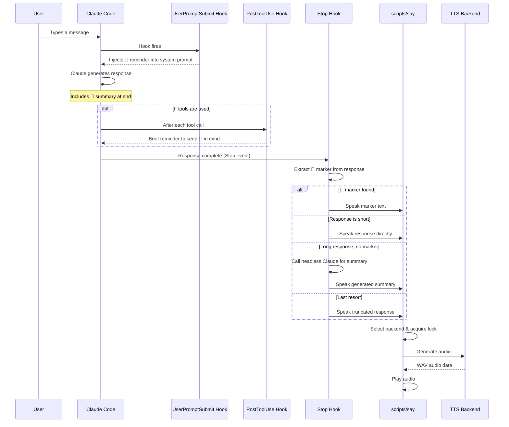

# How It Works

cc-vox is a Claude Code plugin that uses the **hook system** to inject voice feedback into every conversation turn. The entire pipeline is hands-free — once installed, Claude automatically includes voice summaries.

## The Pipeline

## The Three Hooks

### 1. UserPromptSubmit — Inject Reminder

**When:** Every time the user sends a message.

The hook reads `~/.claude/cc-vox.toml` and injects a system message telling Claude to include a `📢` voice summary at the end of its response. This reminder includes:

- The max word limit for summaries
- Style instructions (match user's tone, avoid technical identifiers)
- Any custom personality prompt

### 2. PostToolUse — Brief Nudge

**When:** After each tool call (file reads, edits, bash commands, etc.).

In long tool-heavy responses, Claude can lose track of the voice summary instruction. This hook injects a brief reminder to keep the `📢` summary in mind.

### 3. Stop — Extract & Speak

**When:** Claude finishes its response.

This hook runs the 4-strategy summarization cascade:

| Strategy | Speed | When |
|:---------|:------|:-----|
| **1. Extract `📢` marker** | Instant | Claude included a `📢` line |
| **2. Speak directly** | Instant | Response is short enough (<=`max_words`) |
| **3. Headless Claude** | ~3--5s | Calls `claude -p` to generate a summary |
| **4. Truncate** | Instant | Last resort — truncate the response |

The summary is passed to `scripts/say`, which selects a TTS backend, generates audio, and plays it.

## Audio Playback

The `say` script handles:

1. **Backend selection** — auto-detect or forced, with fallback
2. **Playback locking** — file-based mutex prevents overlapping audio
3. **Audio player detection** — prefers `ffplay` (streaming), falls back to `aplay`, `paplay`, or `afplay`
4. **Session state** — sentinel files in `/tmp/` so the stop hook knows TTS status
