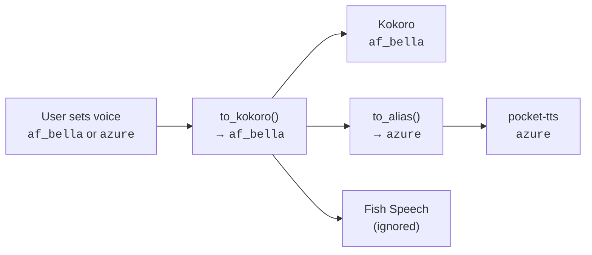

# Voices

cc-vox supports 9 voices that work across all backends. Voice names are automatically mapped between Kokoro (native format) and pocket-tts (alias format).

## Voice Catalog

| Kokoro Name | pocket-tts Alias | Gender | Accent | Default |
|:-----------:|:----------------:|:------:|:------:|:-------:|
| `af_heart` | `alba` | F | American | :material-star: |
| `af_bella` | `azure` | F | American | |
| `af_nicole` | `fantine` | F | American | |
| `af_sarah` | `cosette` | F | American | |
| `af_sky` | `eponine` | F | American | |
| `am_adam` | `marius` | M | American | |
| `am_michael` | `jean` | M | American | |
| `bf_emma` | `azelma` | F | British | |
| `bm_george` | — | M | British | |

!!! note
    `bm_george` has no pocket-tts alias. When using pocket-tts with this voice, the Kokoro name is passed through directly.

## Setting a Voice

=== "Slash command"

    ```
    /voice:speak af_bella
    ```

=== "Config file"

    ```toml
    [core]
    voice = "af_bella"
    ```

=== "Either name works"

    ```
    /voice:speak azure       # pocket-tts alias
    /voice:speak af_bella    # Kokoro name
    ```

    Both resolve to the same voice. cc-vox normalizes all voice identifiers to their canonical Kokoro form internally.

## Cross-Backend Mapping

When you set a voice, cc-vox handles the mapping:

- **Kokoro** receives the canonical Kokoro name (e.g., `af_bella`)
- **pocket-tts** receives the alias (e.g., `azure`)
- **Fish Speech** ignores the voice parameter entirely (uses its own model)



## Voice Resolution Functions

Under the hood, the `tts.voices` module provides:

| Function | Input | Output | Example |
|:---------|:------|:-------|:--------|
| `to_kokoro(voice)` | Any voice identifier | Canonical Kokoro name | `to_kokoro("alba")` → `"af_heart"` |
| `to_alias(voice)` | Any voice identifier | pocket-tts alias | `to_alias("af_heart")` → `"alba"` |

Unknown voices fall back to the default (`af_heart`).
